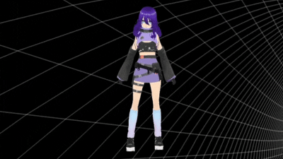

<div align="center">

# 🤖 Fomi AI Assistant

<div align="center">
  
</div>

### Fully Offline Modular Intelligence

[](https://www.rust-lang.org/)
[](https://tauri.app/)
[](LICENSE)
[](https://github.com/Rourugin/Fomi-AI-assistant)
[](https://huggingface.co/)

*Your private, local, and extensible AI companion.*

[Explore the Docs](https://github.com/Rourugin/Fomi-AI-assistant) · [Report Bug](https://github.com/Rourugin/Fomi-AI-assistant/issues) · [Request Feature](https://github.com/Rourugin/Fomi-AI-assistant/issues)

#### [Getting Started](#-getting-started) | [Contributing](./CONTRIBUTING.md) | [License](./LICENSE)

</div>

---

## 🚀 About The Project

**Fomi** is a local assistant built to respect your privacy. Unlike cloud AI (ChatGPT, Claude), Fomi runs **entirely on your hardware**. It uses a plugin system to interact with your OS, allowing it to perform real tasks, not just chat.

### 🌟 Key Features
* 🧠 **Local Brain**: Powered by `Llama-3.2-3B` (GGUF), running entirely on your CPU.
* 🗄️ **Long-term Memory (RAG)**: Uses an embedded **LanceDB** vector store to remember past conversations and user-provided documents.
* ⚡ **Fast Embeddings**: Dedicated `MiniLM` model for instant semantic search without bloating LLM context.
* 🔌 **Plugin System**: Modular architecture using `Mutex` for thread-safe management.
* 🛡️ **Privacy First**: Zero data leaves your machine. Your thoughts and memories stay offline.
* 🎭 **Dynamic Personalities**: Seamlessly switch between different character profiles (Standard, Shy, Sharp-tongue, etc.). Each personality now has its own unique system prompt and memory context.

---

## 🔮 Vision & Business Model

We believe that AI should be a tool you *own*, not a service you *rent*. Fomi is designed to be the "Operating System" for your personal intelligence.

### The Philosophy (AGPLv3)
Fomi Core is open-source under the **GNU AGPLv3** license. This ensures that the core technology remains free and open forever. If anyone builds upon Fomi's core to create a service, they must share their improvements back with the community. We prevent corporate "embrace, extend, extinguish" tactics.

### Sustainability & Monetization
To keep development active without selling user data, we plan two revenue streams:

1.  **Fomi Cloud (SaaS)**: While Fomi runs locally, we will offer an optional encrypted cloud sync and heavy-duty inference hosting for low-end devices.
2.  **Verified Plugins Store**: Developers can publish advanced plugins. We review them for security and quality. Revenue is shared (70/30) with plugin creators, fostering a healthy ecosystem where developers get paid for extending Fomi's capabilities.

*The Core will always be free. You pay only for convenience and specialized extensions.*

---

## 🏗️ Architecture Status

| Module            | Status         | Tech Stack                    |
| :---------------- | :------------- | :---------------------------- |
| **Core Framework**| ✅ Stable      | Rust, Tauri 2.0               |
| **Plugin Manager**| ✅ Stable      | File System, Serde JSON       |
| **AI Engine**     | ✅ Stable      | `llama-cpp-2` (Llama 3.2 3B)  |
| **Vector Memory** | ✅ Stable      | **LanceDB**, `all-MiniLM-L6-v2`|
| **UI / Frontend** | 🚧 In Progress | HTML/JS (Later React/Svelte)  |

---

## 🏗️ Memory System Logic (RAG)

Our implementation of RAG (Retrieval-Augmented Generation) follows a specific local-first pipeline:

1.  **Ingestion**: When a message is processed, it's passed through a lightweight Embedding Model.
2.  **Storage**: The resulting vector is stored in **LanceDB** with metadata (timestamp, session ID).
3.  **Retrieval**: Before generating a response, Fomi searches the vector DB for contextually similar past interactions.
4.  **Augmentation**: Relevant "memories" are injected into the LLM system prompt, giving Fomi a persistent personality and knowledge base.

---

## 🛠️ Getting Started

### Prerequisites
* **Rust**: Stable toolchain.
* **C++ Build Tools**: `cmake`, `clang` (required for AI engine compilation).
* **Node.js**: For frontend bundling.

### Installation

1.  **Clone the repo**
    ```bash
    git clone [https://github.com/Rourugin/Fomi-AI-assistant.git](https://github.com/Rourugin/Fomi-AI-assistant.git)
    ```
2.  **Download the Brain**
    * Get `Llama-3.2-3B-Instruct-Q4_K_M.gguf`.
    * Place it in `./models/model.gguf`.
3.  **Run Development Build**
    ```bash
    cargo tauri dev
    ```

---

## 🧩 Roadmap

- [x] **Phase 1: Foundation** (Architecture, File System, Configs)
- [x] **Phase 2: The Brain** (Llama integration, Chat Loop) 
- [x] **Phase 3: Deep Roots** (Long-term Memory, Vector DB, Advanced Personalities)
- [ ] **Phase 4: The Hub** (Dashboard overhaul, Multi-window UI)
- [ ] **Phase 5: The Body** (Connecting AI to Plugins & System Controls)

---

## 🤝 Community & Contributing

Join the development discussion!
[**Click here to join our Discord Server**](https://discord.gg/7cDum5pk)

See [CONTRIBUTING.md](CONTRIBUTING.md) for development setup and guidelines.

---

<div align="center">
    <i>Built with ❤️ in Rust</i>
</div>